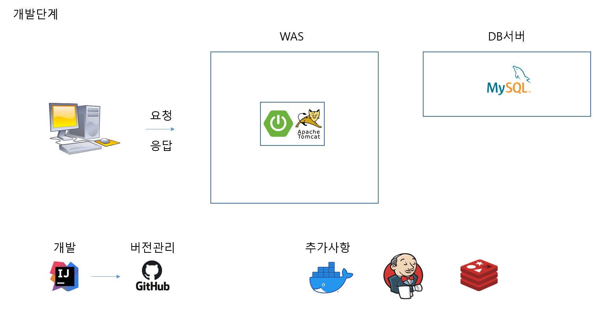
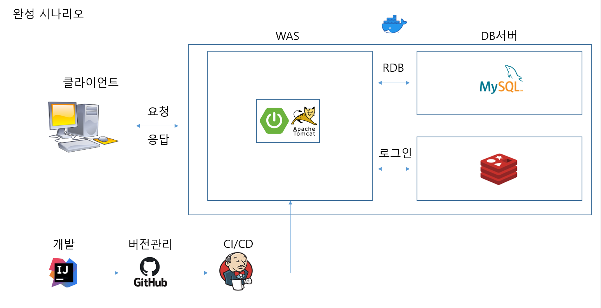

##메이플 스토리 프로젝트
개발 (기술스택)

### 설정
- [x] mysql 설치
  - develop 최신 버전
  - database, user생성 및 모든 권한 부여
    - maple_db : maple/maplepass
- [x] mybatis
  - mysql 연결
  - 테스트 작성
- [x] jsp 설정
  - index.jsp
- [x] favicon 완료

### 회원가입
- [x] 회원가입 DDL 작성
- [x] 회원가입 로직 작성
  - [x] otp기능 추가
  - [x] 비밀번호 암호화 추가
- [x] 약관동의 추가
  - [x] 약관테이블, 약관동의 히스토리 추가

### 로그인 구현
- [x] 로그인 로직 구현
  - [x] 로그인 인증 방식 추가 (OAuth 2.0 + jwt)

### 캐릭터 조회 기능
- [x] 캐릭터 조회화면 추가

### 댓글 기능
- [x] 댓글리스트
- [x] 댓글 작성 시 인증된 회원 체크

### refactoring
- [x] 공통 API 호출
- [ ] 테스트 코드 작성
  - jacoco 
- [ ] 프론트엔드
- [ ] https 적용